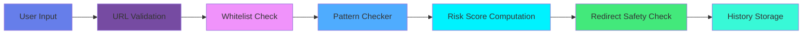
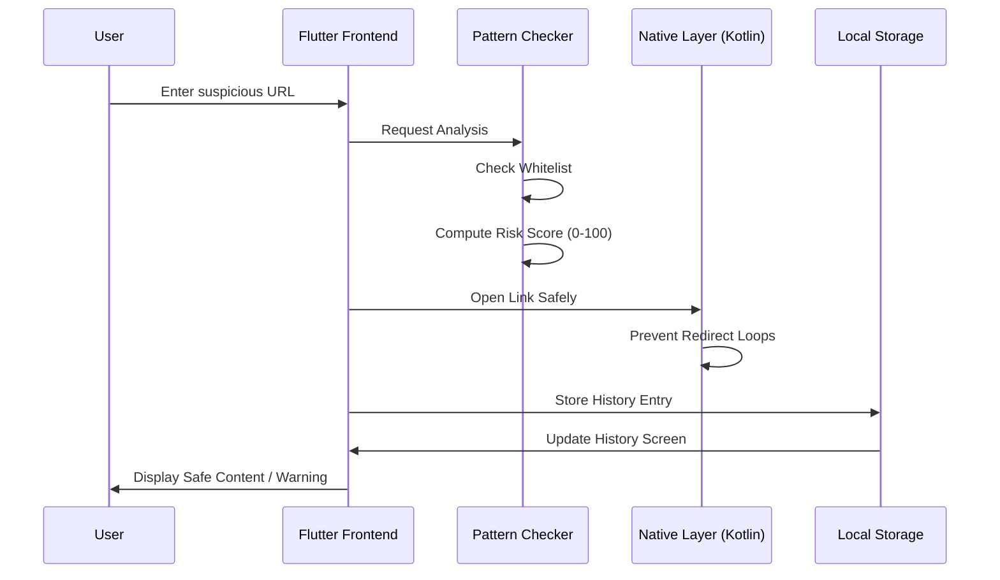

# 🛡️ LinkSafe

<div align="center">

**Open-Source Mobile Security Platform for Real-Time URL Analysis**

[](https://opensource.org/licenses/MIT)
[](https://flutter.dev/)
[](https://dart.dev/)
[](https://kotlinlang.org/)
[](https://www.android.com/)
[](https://github.com/sangsaist/LinkSafe-Android/pulls)

[Features](#-features) • [Quick Start](#-quick-start) • [Architecture](#-system-architecture) • [Contributing](#-contributing)

</div>

---

## 📖 Table of Contents

- [Overview](#-overview)
- [The Problem](#-the-problem)
- [Our Solution](#-our-solution)
- [Key Features](#-features)
- [System Architecture](#-system-architecture)
- [Technology Stack](#-technology-stack)
- [Quick Start](#-quick-start)
- [Security Features](#-security-features)
- [Roadmap](#-roadmap)
- [Contributing](#-contributing)
- [License](#-license)

---

## 🌟 Overview

**LinkSafe** is a comprehensive mobile utility app designed to track, analyze, and verify URLs in real-time. By providing detailed risk scoring, domain whitelisting, and historical analytics, LinkSafe helps you stay safe from phishing attempts and malicious websites directly from your Android device.

### 🎯 Mission

Transform the uncertain experience of opening unknown links into a **structured, measurable, transparent process** that enables data-driven mobile security at an individual level.

---

## 💡 The Problem

Most users face critical challenges when determining the safety of links they receive:

<table>
<tr>
<td width="50%">

### ❌ **Current State**
- ✗ Guessing whether a link is safe
- ✗ Vulnerability to redirect loops
- ✗ No history of scanned malicious links
- ✗ Binary (Safe/Unsafe) warnings with no context
- ✗ Time-consuming manual verification

</td>
<td width="50%">

### ✅ **With LinkSafe**
- ✓ Automated pattern-based risk analysis
- ✓ Infinite redirect loop prevention
- ✓ Complete tracking history locally stored
- ✓ Granular risk scoring (0-100)
- ✓ Instant, on-device verification

</td>
</tr>
</table>

---

## 🚀 Our Solution

### **Analysis-Driven Architecture**



### **Core Philosophy**

> **Analysis is the first line of defense.**  
> Risk scores are computed locally.  
> Privacy is maintained through on-device processing.

This separation ensures **speed**, **accuracy**, and **maximum user privacy**.

---

## ✨ Features

<div align="center">

| 🔍 Pattern Checking | 🛡️ Domain Whitelist | 📊 Risk Analytics | 📖 History Tracking |
|:-------------------:|:-------------------:|:-----------------:|:-------------------:|
| Regex-based scanning | Trusted site verification | 0-100 Score Metric | Persistent Storage |
| Deep URL Inspection | Known safe domain bypass | Confidence Indicators | Shared Preferences |
| Redirect Loop Fixes | Fast-path resolution | Interactive Graphics | Detailed Timestamps |

</div>

### 🕵️ **Advanced Detection**
- 📈 Analyze URLs for obfuscations and suspicious characters
- 📊 Calculate granular risk scores rather than binary flags
- 🏅 Recognize and fast-track whitelisted domains instantly
- 🔄 Stop infinite redirect loops natively via Kotlin integration

### 📱 **Seamless User Experience**
- 👀 Fluid bottom navigation architecture
- ✅ Instant risk classification and detailed reporting
- 📉 Easily access previously checked URLs via History Screen
- 📋 Copy and clear links intuitively

---

## 🏗️ System Architecture

### **High-Level Architecture**

```
┌─────────────────────────────────────────────────────────────┐
│                     User Interface (Flutter)                 │
│         Main Screen • History Screen • Bottom NavBar         │
└────────────────────────┬────────────────────────────────────┘
                         │ Method Channels & State
┌────────────────────────▼────────────────────────────────────┐
│                    Business Logic (Dart)                     │
│  ┌──────────────────┬──────────────────┬─────────────────┐   │
│  │ PatternChecker   │  HistoryService  │  URL Validator  │   │
│  └──────────────────┴──────────────────┴─────────────────┘   │
└────────────────────────┬────────────────────────────────────┘
                         │ Native Bridgework
┌────────────────────────▼────────────────────────────────────┐
│                   Native Layer (Android)                     │
│  MainActivity.kt (Redirect Loop Prevention & Invocation)     │
└────────────────────────┬────────────────────────────────────┘
                         │ Local Storage
┌────────────────────────▼────────────────────────────────────┐
│                  Database Layer (SharedPreferences)          │
│            Persistent History Entries • User Settings        │
└─────────────────────────────────────────────────────────────┘
```

### **Data Flow**



---

## 🛠️ Technology Stack

<div align="center">

### **Frontend & Core Logic**


### **Native Integration & Persistence**


</div>

| Layer | Technology | Purpose |
|-------|-----------|---------|
| **Framework** | Flutter | Cross-platform UI toolkit |
| **Language** | Dart | Core application logic |
| **Native Base** | Kotlin | Android specific integrations (Redirects) |
| **Storage** | SharedPreferences | Fast, persistent local data |
| **Routing** | Flutter Navigator | Smooth screen transitions |
| **Analytics** | PatternChecker Service | Risk computation algorithm |

---

## 🚀 Quick Start

### **Option 1: Build from Source — 5 Minutes**

```bash
# 1. Clone the repository
git clone https://github.com/sangsaist/LinkSafe-Android.git
cd LinkSafe-Android

# 2. Get dependencies
flutter pub get

# 3. Connect your Android device or start an emulator

# 4. Run the application
flutter run
```

### **System Requirements**
- Flutter SDK 3.x+
- Android Studio / Android SDK
- Minimum Android SDK Version: 21 (Lollipop)
- Target Android SDK Version: 33+

---

## 🔒 Security Features

- ✅ **On-Device Analysis** – URLs are analyzed locally without sending personal data to third parties.
- ✅ **Anti-Redirect Loops** – Native Kotlin defenses stop infinite tracking redirects.
- ✅ **Risk Scoring Engine** – Heuristics-based scoring for precise threat detection.
- ✅ **Granular Whitelisting** – Bypasses scans for definitively safe domains to eliminate false positives.
- ✅ **Non-Persistent Tracking** – App does not track user location or inject trackers.

---

## 🗺️ Roadmap

> **Project status:** Active development and refinement.

### ✅ **v1.0 – Foundation** (Current)

- ✅ Bottom Navigation integration
- ✅ URL PatternChecking logic
- ✅ Basic User Interface
- ✅ Infinite redirect prevention in Android layer
- ✅ Granular risk scoring (0-100) implementation
- ✅ History Service with persistent local storage
- ✅ Whitelisted domains database

### 🔜 **v1.5 – Enhanced Analytics** (Planned)

- 🔄 Integration with external threat intelligence APIs (e.g., Google Safe Browsing)
- 🔄 URL shortener unmasking
- 🔄 Background clipboard scanning
- 🔄 Advanced visualizations for URL components

### 📊 **v2.0 – Cross-Platform** (Future)

- 📊 iOS Compatibility and Native Swift bridging
- 📊 Web Extension integration
- 📊 Cloud sync for URL history

---

## 📁 Project Structure

```text
LinkSafe-Android/
├── android/
│   ├── app/src/main/kotlin/
│   │   └── .../MainActivity.kt # Redirect Logic & Method Channels
├── lib/
│   ├── main.dart               # Entry point & App Shell
│   ├── screens/                
│   │   ├── checker_screen.dart # Main URL Scanner UI
│   │   └── history_screen.dart # Checked Links History UI
│   ├── services/
│   │   ├── pattern_checker.dart# Risk Scoring & Whitelist
│   │   └── history_service.dart# SharedPreferences wrapper
│   └── models/
│       └── history_entry.dart  # Data model for checked URLs
├── pubspec.yaml                # Flutter dependencies
└── README.md
```

---

## 🤝 Contributing

Contributions are welcome! Help us make mobile browsing safer for everyone.

1. **Fork** the repository
2. **Create** a feature branch: `git checkout -b feature/your-feature`
3. **Commit** your changes: `git commit -m 'feat: Add your feature'`
4. **Push** to the branch: `git push origin feature/your-feature`
5. **Open** a Pull Request

- 🐛 Report bugs via [GitHub Issues](https://github.com/sangsaist/LinkSafe-Android/issues)
- 💡 Suggest features via [GitHub Discussions](https://github.com/sangsaist/LinkSafe-Android/discussions)

---

## 📄 License

This project is licensed under the **MIT License** — see the [LICENSE](LICENSE) file for details.

---

<div align="center">

### **Built with ❤️ for Security**

**Making the Web Safe, One Link at a Time.**

[⬆ Back to Top](#%EF%B8%8F-linksafe)

---

<sub>© 2026 LinkSafe. Open Source Project under MIT License.</sub>

</div>
